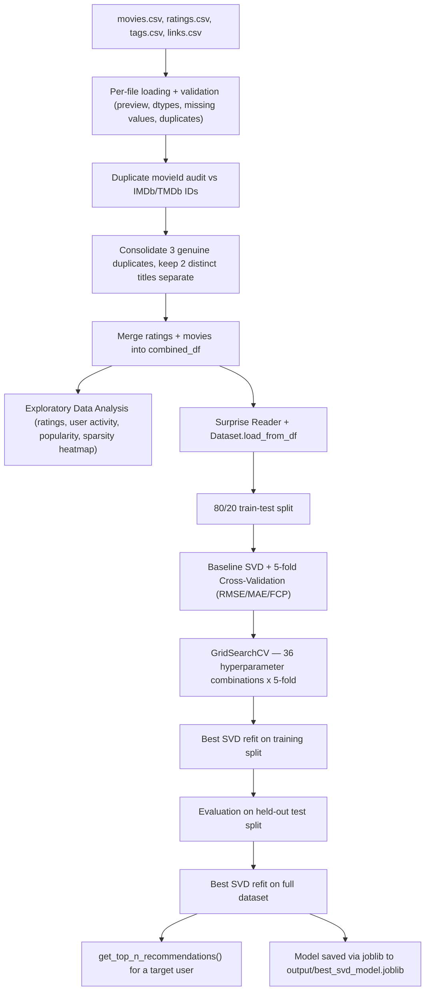

# 🎬 Movie Recommendation System (SVD Collaborative Filtering)

Personalized movie recommendations learned purely from rating patterns, no genres, tags, or content features required to make a prediction.


-orange?style=flat)


## 📌 Overview

This repository contains a Jupyter/Kaggle notebook that builds a collaborative filtering movie recommender using **Singular Value Decomposition (SVD)** matrix factorization, implemented with the `scikit-surprise` library, trained on the **MovieLens "latest small" dataset** (100,836 ratings from 610 users across 9,724 rated movies).

The notebook covers the full pipeline end to end. It loads and validates all four raw MovieLens CSVs, audits and resolves a handful of duplicate movie IDs against external IMDb/TMDb identifiers, runs exploratory data analysis on rating and user behavior patterns, trains a baseline SVD model with 5-fold cross-validation, tunes hyperparameters with `GridSearchCV`, refits and evaluates the tuned model on a held-out test set, retrains it one more time on the full dataset for production use, and finally generates personalized top-10 recommendations for a target user before saving the trained model with `joblib`.

The complete notebook, including every EDA plot and print output, is also published on Kaggle: **[movie-recomendation-svd](https://www.kaggle.com/code/viochristian/movie-recomendation-svd)**.

### ✨ Key Features
* 📂 **Structured multi-file ingestion.** All four MovieLens CSVs (`movies`, `ratings`, `tags`, `links`) are loaded with a repeatable diagnostic routine covering head/tail/sample previews, dtypes, summary statistics, missing values, duplicated rows, and per-column unique value counts.
* 🔍 **Duplicate movie ID audit.** Titles mapped to more than one `movieId` are cross-referenced against their IMDb/TMDb identifiers to tell genuine data-linking errors apart from distinct films that happen to share a title. Three titles (*Confessions of a Dangerous Mind*, *Eros*, *Saturn 3*) are consolidated, while two others (*Emma*, *War of the Worlds*) are explicitly kept separate because their genres and TMDB IDs confirm they're different productions.
* 📊 **Exploratory data analysis suite.** Rating distribution, user activity distribution, the top 5 most active and most generous/critical raters, movie popularity and rating leaders, and a full user-item sparsity heatmap (98.30% sparse).
* 🧠 **SVD collaborative filtering.** An 80/20 train-test split plus 5-fold cross-validation reporting RMSE, MAE, and FCP, so the baseline model's reliability is measured before any tuning happens.
* 🎛️ **Hyperparameter tuning via GridSearchCV.** 36 combinations of `n_factors`, `n_epochs`, `lr_all`, and `reg_all` are evaluated with 5-fold cross-validation to find the configuration with the lowest RMSE.
* 🏭 **Production refit and recommendation generation.** The tuned model is retrained on the entire dataset (not just the training split) to make full use of all available ratings, and a `get_top_n_recommendations()` helper turns its predictions into a readable top-N list with movie titles and genres attached.
* 💾 **Model persistence.** The final trained model is serialized to `output/best_svd_model.joblib` so it can be reused without retraining from scratch.

---

## 🎯 Context & Problem Statement

Recommendation systems aren't just a machine learning exercise, they exist because both sides of a content catalog run into a real, measurable problem without one. On the viewer's side, choosing what to watch out of thousands of options is a well-documented source of decision fatigue: the more options a person is shown with no guidance, the more likely they are to give up on choosing at all and just leave. On the platform's side, that abandoned session has a direct cost. Netflix's own product executives have publicly estimated that their recommendation engine saves the company more than a billion dollars a year, almost entirely through reduced subscriber churn and getting more value out of the content they already pay for, rather than through any single flashy feature. This project is a smaller-scale version of that same underlying problem: given a catalog and a history of what people have rated, how do you turn that into a ranked list that's actually relevant to one specific person, using nothing but the rating data itself.

### 🎬 The Problem
Narrowed down to this specific dataset and notebook, that broader engagement issue shows up as two concrete, technical problems that any collaborative filtering approach has to deal with before it can produce a single usable recommendation. Neither one is really about the modeling algorithm itself, they're both about what the system is working with before a single prediction gets made: how much of the catalog is realistically reachable by a user without guidance, and how trustworthy the raw rating data actually is once you look past the surface. Getting either one wrong means the resulting recommendations are built on a shaky foundation no matter how sophisticated the model on top of them is, which is exactly why they're worth spelling out before getting into the model at all.
1. **A large catalog is a genuine engagement problem, not just an inconvenience.** With thousands of movies to choose from and no personalization, a user is left either scrolling a generic "most popular" list that ignores their individual taste, or manually searching for something they already know they want, which defeats the purpose of having a large catalog in the first place. Every extra minute spent undecided is a minute closer to the person giving up and closing the app, and for whoever runs the catalog, whether that's a streaming platform, a rental service, or an internal content library, that translates directly into shorter sessions, lower engagement, and ultimately lower retention. This isn't a hypothetical concern either, it's the exact problem Netflix's own published figures on recommendation-driven savings are describing.
2. **The rating data available to learn from is sparse and, on top of that, noisy.** The user-item ratings matrix in this dataset is 98.30% empty, meaning the overwhelming majority of user-movie pairs have no rating at all for a similarity-based approach to lean on, which is the normal state for almost any real ratings dataset, not a quirk specific to this one. To make things harder, a handful of movies were recorded under two different `movieId` values during data collection. Left unresolved, that would split a single film's rating signal across two IDs, understating its true popularity to the model and diluting the very signal any recommender is trying to learn from.

### 💡 The Solution
Solving the broader engagement problem starts by solving these two specific, technical ones, and each is addressed by a deliberate piece of the pipeline rather than a generic modeling choice made for its own sake. Rather than reaching for a hand-crafted similarity rule that would struggle the moment most of the matrix is empty, or training on the raw data as-is and hoping the noise averages out, the approach here is to fix the data quality issue first and then let the model learn directly from the corrected signal.
1. **Matrix factorization (SVD) instead of a fixed similarity rule.** Rather than relying on hand-crafted similarity metrics that struggle when most of the matrix is empty, SVD learns a compact set of latent taste factors for every user and every movie directly from the sparse rating matrix. Those learned factors let the model estimate a rating for movies a user has never rated, closing the gap described in problem 1 with a genuinely personalized ranked list instead of a generic most-popular chart.
2. **A manual, IMDb/TMDb-verified duplicate ID audit before any training happens.** By checking each duplicated title's external identifiers before merging anything, the pipeline consolidates the IDs that are genuinely the same film while explicitly leaving distinct adaptations alone. This directly protects the integrity of the matrix that problem 2 identified as noisy, so the model is learning from clean, correctly-attributed rating signals rather than fragmented or wrongly-merged ones.

Even with both of these in place, the current version still has real gaps, covered in the System Limitations and Future Work sections below.

---

## 📊 Quantitative Metrics

Ratings in this dataset run on a 0.5 to 5.0 scale, so an RMSE around 0.87 means the model's predicted rating is, on average, well under one star off from the true rating.

| Stage | RMSE ↓ | MAE ↓ | FCP ↑ |
| :--- | :---: | :---: | :---: |
| Baseline SVD, 5-fold CV average | 0.8727 ± 0.0069 | 0.6708 ± 0.0043 | 0.6596 ± 0.0031 |
| Baseline SVD, held-out test split | 0.8804 | 0.6763 | 0.6583 |
| Tuned SVD, best GridSearchCV CV score | 0.8644 | 0.6644 | not optimized for FCP |
| **Tuned SVD, held-out test split** | **0.8726** | **0.6704** | **0.6701** |

**Best hyperparameters found** (36 combinations searched, 5-fold cross-validation each): `n_factors=150`, `n_epochs=30`, `lr_all=0.005`, `reg_all=0.1`, `random_state=42`. Search space covered `n_factors` in `[50, 100, 150]`, `n_epochs` in `[15, 20, 30]`, `lr_all` in `[0.002, 0.005]`, and `reg_all` in `[0.02, 0.1]`.

*RMSE = Root Mean Squared Error, MAE = Mean Absolute Error, FCP = Fraction of Concordant Pairs (higher is better, everything else lower is better).*

---

## 🏗️ Architecture & Data Flow



---

## 💻 Installation & Reproduction Steps

### 📋 Prerequisites
* **Python 3.10 or newer** is required (the original notebook ran on Python 3.12).
* **`scikit-surprise` compiles native extensions at install time**, so a few things are worth knowing before you run `pip install`.
  * It needs `numpy` to already be available in the environment before it builds, so install `numpy` first (or install everything from `requirements.txt` together and let pip sequence it) rather than installing `scikit-surprise` into a completely bare environment.
  * On Windows, if there's no prebuilt wheel for your Python version, pip will try to compile it locally and fail with a message asking for **Microsoft C++ Build Tools**. Installing the "Desktop development with C++" workload from the [Visual Studio Build Tools installer](https://visualstudio.microsoft.com/visual-cpp-build-tools/) resolves that.
  * `scikit-surprise` has occasionally been built against `numpy` 1.x internals, so if you hit a "compiled using NumPy 1.x cannot be run in NumPy 2.x" error after installing, downgrading with `pip install "numpy<2"` and reinstalling `scikit-surprise` afterward is the usual fix.

### 🛠️ CLI Installation & Execution

#### 1. Clone the Repository
```bash
git clone https://github.com/viochris/movie-recommendation-svd.git
cd movie-recommendation-svd
```

#### 2. Create and Activate a Virtual Environment
```bash
# macOS/Linux
python3 -m venv venv
source venv/bin/activate

# Windows
python -m venv venv
venv\Scripts\activate
```

#### 3. Install Dependencies
```bash
pip install --upgrade pip
pip install -r requirements.txt
```

#### 4. Get the Dataset
The notebook was built on Kaggle and reads the MovieLens "latest small" dataset from `/kaggle/input/...`. To run it locally, download the same dataset directly from [GroupLens](https://grouplens.org/datasets/movielens/latest/) (the "ml-latest-small.zip" package), extract `movies.csv`, `ratings.csv`, `tags.csv`, and `links.csv` into a local `data/` folder, and update the `file_paths` list near the top of the notebook to point to that folder instead of the Kaggle input path.

#### 5. Run the Notebook
```bash
jupyter notebook movie-recomendation-svd.ipynb
```
Run all cells from top to bottom. Grid search over 36 hyperparameter combinations is the slowest step (roughly 5 minutes on the original run) since each combination is evaluated with 5-fold cross-validation.

---

## 📝 Conclusion

Putting the whole pipeline together, this project set out to solve two concrete problems: a large, unpersonalized catalog that costs engagement, and a sparse, noisy rating dataset that makes a naive similarity approach unreliable. The SVD-based collaborative filtering pipeline built here addresses both directly. It learns latent taste factors purely from the rating matrix, which lets it rank the entire unwatched catalog for any given user instead of falling back on a generic popularity list, and it does so on top of a manually audited dataset where duplicate movie IDs were resolved against external IMDb/TMDb identifiers first, so the model is learning from a clean signal rather than a fragmented one.

The numbers back this up in a measurable way. The baseline SVD model already reached an RMSE of about 0.87 on both cross-validation and the held-out test set, meaning its predicted ratings land, on average, well under one star away from the true rating on a 0.5 to 5.0 scale. Hyperparameter tuning via GridSearchCV then pushed that further, improving the held-out test RMSE to 0.8726 and MAE to 0.6704, alongside a noticeably higher FCP of 0.6701 compared to the baseline's 0.6583, meaning the tuned model is also better at correctly ranking which of two movies a user would prefer, not just at predicting individual scores accurately.

That said, this is a solution to the two problems above specifically, not a complete, production-ready recommender. It still has real, honest gaps. The model has no way to score a movie or a user it has never seen a rating for, since it learns exclusively from historical `(userId, movieId, rating)` triples and ignores genre, tag, and other metadata that's already sitting in the dataset. The tuning process also only searched a fixed grid of 36 combinations rather than a continuous space, so "best hyperparameters" here means best within that grid, not a guaranteed global optimum. And the entire system currently lives inside a notebook, with no API or interface to query it interactively. The sections immediately below go through each of these gaps in detail, and lay out concrete next steps for closing them, starting with the ones that would matter most for turning this from a working notebook into something closer to a real product.

---

## ⚠️ System Limitations

### 🏗️ Architectural Limitations
* **No serving layer.** Recommendations are only produced by calling `get_top_n_recommendations()` inside the notebook. There's no API endpoint or UI to query the trained model interactively without opening and rerunning cells.
* **Single held-out split for the final numbers.** The final tuned-model metrics come from one 80/20 train-test split layered on top of the 5-fold cross-validation used during grid search, so those specific numbers carry a bit more split-to-split variance than the cross-validated averages do.
* **Unused imports left over from a shared template.** The setup cell imports a wide range of classification and tuning libraries (XGBoost, LightGBM, CatBoost, `imbalanced-learn`, LIME, several scikit-learn classifiers, and Optuna) that are never actually called anywhere in this notebook's pipeline. They appear to be carried over from a shared project template rather than being specific to this model.

### 🔬 Model & Domain Limitations
* **Structural cold-start problem.** SVD here learns purely from `(userId, movieId, rating)` triples. It has no way to score a brand-new movie that has zero ratings yet, or a brand-new user with no rating history at all, because there's no learned latent vector for either one to fall back on. `genres.csv` and `tags.csv` are loaded and used for display and duplicate-ID resolution, but never as model input, so none of that metadata currently helps with this gap.
* **Small dataset relative to production catalogs.** MovieLens "latest small" is a useful, well-understood benchmark, but at ~100k ratings across ~9.7k movies and 610 users it's far smaller than a real streaming catalog's data (tens of millions of ratings). The absolute error numbers reported here may not transfer directly to a larger, even sparser real-world catalog.
* **Grid search covers a fixed, coarse grid rather than a continuous search.** "Optimal hyperparameters" here means the best configuration within the 36 combinations that were actually tried, not a guaranteed global optimum. `optuna` is already imported at the top of the notebook, which suggests a more efficient search was planned but not yet wired in.

---

## 🚀 Future Work
* **Hybrid or content-based signals for cold start.** `genres.csv` and `tags.csv` are already being loaded. Feeding that metadata into the model, or blending it with a content-based similarity score, would give the system something to fall back on for new movies and new users that pure collaborative filtering can't score today.
* **Benchmark against an alternative matrix factorization approach**, such as an ALS-based model, to compare accuracy and training/scaling behavior against this SVD implementation on the same dataset.
* **Replace the manual GridSearchCV grid with Optuna**, which is already imported but unused, for a more efficient, continuous hyperparameter search instead of a fixed set of combinations.
* **Scale up to a larger MovieLens release** (1M or 25M ratings) or a different ratings dataset entirely, to see whether the tuned hyperparameters and error rates hold up on a bigger, sparser catalog.
* **Wrap `get_top_n_recommendations()` in a small API or Streamlit demo** so recommendations can be queried interactively instead of by editing and rerunning notebook cells.
* **Incorporate implicit feedback signals**, like tagging activity or watch counts, alongside the explicit star ratings for a potentially richer training signal.

---

## 📄 License
This project is licensed under the MIT License. See the [LICENSE](LICENSE) file for details.

---
**Author:** [Silvio Christian Joe](https://github.com/viochris)

*"Recommending from patterns, not opinions."*
